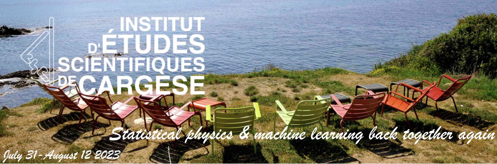
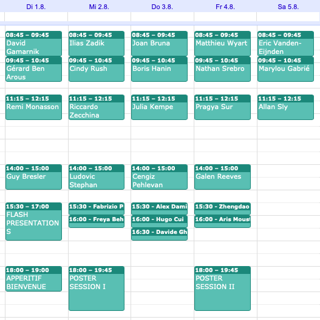
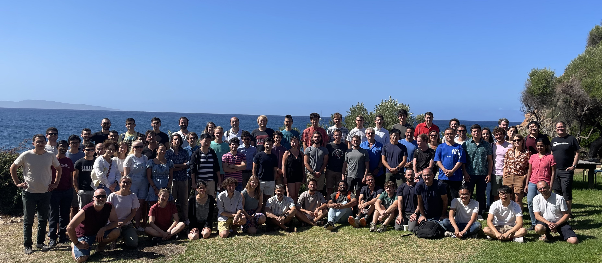
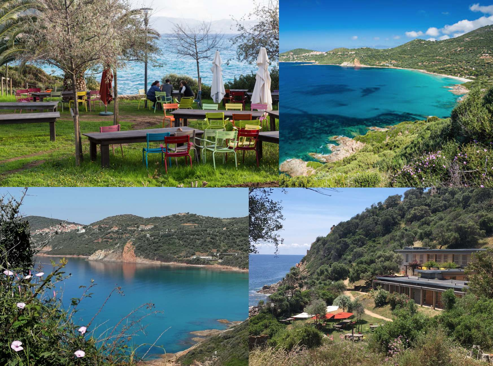

The past decade brought a revolution to machine learning: algorithms are now able to deal with tasks and amounts of data that seemed to be science fiction only a decade ago. The statistical physics community and the machine learning ones were connected and indeed many concepts and algorithms of machine learning have roots in physics. It is time to revive and strengthen this connection. After [a wonderful event in 2018](https://krzakala.github.io/cargese.io/), we gather once again in Cargese in 2023, from July 31st to August 12th, and bring together researchers from machine learning & statistical physics to take full advantage of the strong link between the two fields to make further scientific progress.  The program will concentrate on theoretical aspect of machine learning and high-dimensional statistics, and their deep link with physics, as well as the direct applications of machine learning techniques in physics, for instance for sampling and generative problems.

__Organisers:__  Damien Barbier (EPFL, IdePhics Lab.), Vittorio Erba (EPFL, SPOC Lab.), Florent Krzakala (EPFL, IdePhics Lab.), Bruno Loureiro (ENS, Paris), Lenka Zdeborova (EPFL, SPOC Lab.) 

# Schedule

Some of the slides of the talks can be found 
[here](https://github.com/Cargese2023/Cargese2023.github.io/tree/main/slides).

The program of the workshop:

<!-- 
<iframe src="https://calendar.google.com/calendar/embed?height=600&wkst=1&bgcolor=%23ffffff&ctz=Europe%2FZurich&mode=WEEK&src=Y2FyZ2VzZTIwMjNAZ21haWwuY29t&color=%23039BE5" style="border:solid 1px #777" width="800" height="600" frameborder="0" scrolling="no"></iframe> -->

# Invited speakers

Gérard 	Ben Arous 	(NYU) 
Guy 	Bresler	(MIT) 
Joan 	Bruna	(NYU) 
Ahmed 	El Alaoui	(Cornell)  
Marylou 	Gabrié	(Polytechnique Paris)  
David 	Gamarnik	(MIT) 
Cedric 	Gerbelot	(NYU) 
Sebastian 	Goldt	(SISSA Trieste)  
Alice 	Guionnet	(ENS Lyon)  
Suriya 	Gunasekar	(Microsoft) 
Boris 	Hanin	(Princeton)  
Julia 	Kempe	(NYU) 
Bruno Loureiro (ENS Paris) 
Yue	Lu	(Harvard)  
Antoine 	Maillard	(ETH Zurich) 
Theodor	Misiakiewicz	(Stanford)  
Remi 	Monasson	(ENS Paris)  
Cristopher 	Moore	(Santa Fe Institute) 
Cengiz 	Pehlevan	(Harvard)  
Galen 	Reeves	(Duke) 
Cindy	Rush	(Columbia)  
Andrew 	Saxe	(UCL) 
Mark 	Sellke	(Harvard)  
Guilhem 	Semerjian 	(ENS Paris)  
Subhabrata 	Sen	(Harvard)  
Allan 	Sly	(Princeton)  
Nathan 	Srebro	(TTIC) 
Ludovic Stephan (EPFL) 
Pragya 	Sur	(Harvard)  
Eric 	Vanden-Eijnden	(NYU) 
Soledad 	Villar	(Johns Hopkins) 
Matthieu 	Wyart 	(EPFL)  
Ilias 	Zadik 	(MIT) 
Riccardo 	Zecchina	(Bocconi)

# Contributed speakers

Demian Barbier (EPFL) 
Freya	Behrens (EPFL) 
Stefan	Boettcher (Emory) 
Zhengdao	Chen (Google) 
Lucas	Clarte (EPFL) 
Hugo	Cui (EPFL) 
Alex	Damian (Princeton) 
Yatin	Dandi    (EPFL) 
Anna	Dawid (Flatiron) 
Vittorio Erba (EPFL) 
Federica	Gerace (SISSA Trieste) 
Davide	Ghio (EPFL) 
Brice	Huang (MIT) 
Justin	Ko (ENS Lyon) 
Jean-Christophe	Mourrat (ENS Lyon and CNRS) 
Aris	Moustakas (National Kapodistrian University of Athens) 
Matteo	Negri (Rome La Sapienza) 
Ari	Pakman (Ben-Gurion University) 
Fabrizio	Pittorino (Bocconi) 
Stefano	Sarao Mannelli (Gatsby & SWC Universtiy College London) 
Inbar	Seroussi (Tel-Aviv University) 
Jamie	Simon (UC Berkeley) 
Umberto	Tomasini (EPFL) 
Jacob	Zavatone-Veth (Harvard) 

# List of Participants

Urte			Adomaityte			(King's College) 
Scott			Armstrong			(NYU Courant) 
Luca			Arnaboldi			(EPFL) 
Freya			Behrens			    (EPFL) 
Pierfrancesco	Beneventano		    (Princeton) 
Stefan			Boettcher			(Emory) 
Blake			Bordelon			(Harvard) 
Brujic			Jasna			(NYU) 
Zhengdao		Chen			    (Google) 
Lucas			Clarte			    (EPFL) 
Hugo			Cui			        (EPFL) 
Alex			Damian			    (Princeton) 
Yatin			Dandi			    (EPFL) 
Anna			Dawid			    (Flatiron) 
Elizaveta		Demyanenko			(Bocconi) 
Daniil			Dmitriev			(ETH Zurich) 
Odilon			Duranthon			(EPFL) 
Kirsten			Fischer			    (Juelich Research Center) 
Federica		Gerace			    (SISSA Trieste) 
Davide			Ghio			    (EPFL) 
Mortiz          Haas                (University of Tübingen) 
Mengjian		Hua			        (NYU Courant) 
Brice			Huang			    (MIT) 
Chris			Jones			    (Bocconi) 
Nirmit			Joshi			    (Toyota Technological Institute Chicago) 
Christian		Keup			    (EPFL) 
Justin			Ko			        (ENS Lyon) 
Clarissa		Lauditi			    (Politecnico Turin) 
Noam            Levi                (Tel Aviv University) 
Mufan           Li                  (University of Toronto) 
Stephan			Ludovic			    (EPFL) 
Pierre			Mergny			    (EPFL) 
Jean-Christophe	Mourrat			    (ENS Lyon and CNRS) 
Aris			Moustakas			(National Kapodistrian University of Athens) 
Matteo			Negri			    (Rome La Sapienza) 
Ari			    Pakman			    (Ben-Gurion University) 
Luca			Pesce			    (EPFL) 
Koubbi			Hugo			(EPFL) 
Arianna			Piana			    (Weizmann Institute) 
Giovanni		Piccioli			(EPFL) 
Vanessa			Piccolo			    (ENS Lyon) 
Fabrizio		Pittorino			(Bocconi) 
Riccardo		Rossetti			(Duke) 
Mahalakshmi		Sabanayagam		    (TU Munich) 
Stefano			Sarao Mannelli		(Gatsby & SWC Universtiy College London) 
Christoph		Schönle			    (École Polytechnique (CMAP)) 
Inbar			Seroussi			(Tel-Aviv University) 
Cheng			Shi			        (University of Basel) 
Jamie			Simon			    (UC Berkeley) 
Sylvia          Serfaty				(NYU Courant Institut) 
Umberto			Tomasini			(EPFL) 
Emanuele		Troiani			    (EPFL) 
Nikolaos		Tsilivis			(NYU) 
Aditya			Varre			    (EPFL) 
Rodrigo         Veiga               (EPFL) 
Maksim			Velikanov			(Technology Innovation Institute) 
Matteo			Vilucchio			(EPFL) 
Atsushi			Yamamura			(Stanford) 
Jacob			Zavatone-Veth		(Harvard) 
Alexander		Zlokapa			    (MIT) 

# Registration

Applications are closed.

<!-- The selection of the participants will take place in the days following the deadline (31st March 2023).  -->

# Practical informations

The workshop cost is 1100 euros per participant, covering accommodation, lunches and breakfasts. 

While participant can arrive on 31/7 and leave on 12/8, the conference will take place between 1/8 and 11/8.

More information can be found on [the institute webpage](https://iesc.universita.corsica/?lang=en).

The poster of the event can be downloaded [here](Affiche-Krzakala-2023.pdf)

# Contacts

For any question, write [cargese2023@gmail.com](mailto:cargese2023@gmail.com).

Feel free to tweet about the workshop! 

<a href="https://twitter.com/intent/tweet?button_hashtag=cargese2023&ref_src=twsrc%5Etfw" class="twitter-hashtag-button" data-show-count="false"> #cargese2023</a>

<!-- # Organization Committee:
Florent Krzakala (EPFL, IdePhics Lab.), Lenka Zdeborova (EPFL, SPOC Lab.), Vittorio Erba (EPFL, SPOC Lab.), Damien Barbier (EPFL, IdePhics Lab.)
           -->
<!-- <a href="https://twitter.com/intent/tweet?button_hashtag=cargese2023&ref_src=twsrc%5Etfw" class="twitter-hashtag-button" data-show-count="false">Tweet #cargese2023</a> -->

### Sponsors

