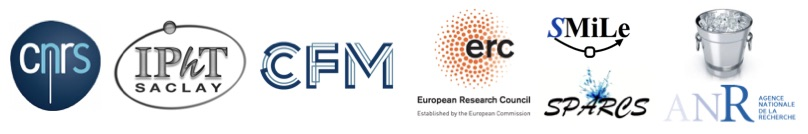

The past decade brought a revolution to machine learning: algorithms are now able to deal with tasks and amounts of data that seemed to be science fiction only a decade ago. The statistical physics community and the machine learning ones were connected and indeed many concepts and algorithms of machine learning have roots in physics. It is time to revive and strenghten this connection. After [a wonderful event in 2018](https://krzakala.github.io/cargese.io/), we gather once again in Cargese in 2023, and bring together researchers from machine learning & statistical physics to take full advantage of the strong link between the two fields to make further scientific progress.  The program will concentrate on theoretical aspect of machine learning and high-dimensional statistics, and their deep link with physics. as well as the direct application of machine learning technics in physics, for instance for sampling problems, a direction that is currently whitenessing a burst of activity. The format will be several (~10) 3h introductory lectures, and about twice as many contributed invited talks.

# Organization Committee:
Florent Krzakala (EPFL, IdePhics Lab.), Lenka Zdeborova (EPFL, SPOC Lab.)

#  Announcement: 
You enjoy the school ? We organizers (Florent Krzakala and Lenka Zdeborova) are looking for postdocs to work on on these topics in EPFL in Lausanne. Come talk to us during the conference!

          
<a href="https://twitter.com/intent/tweet?button_hashtag=cargese2018&ref_src=twsrc%5Etfw" class="twitter-hashtag-button" data-show-count="false">Tweet #cargese2018</a>

More information on [the institute webpage](http://www.iesc.univ-corse.fr/index.php?id=1&L=1)

