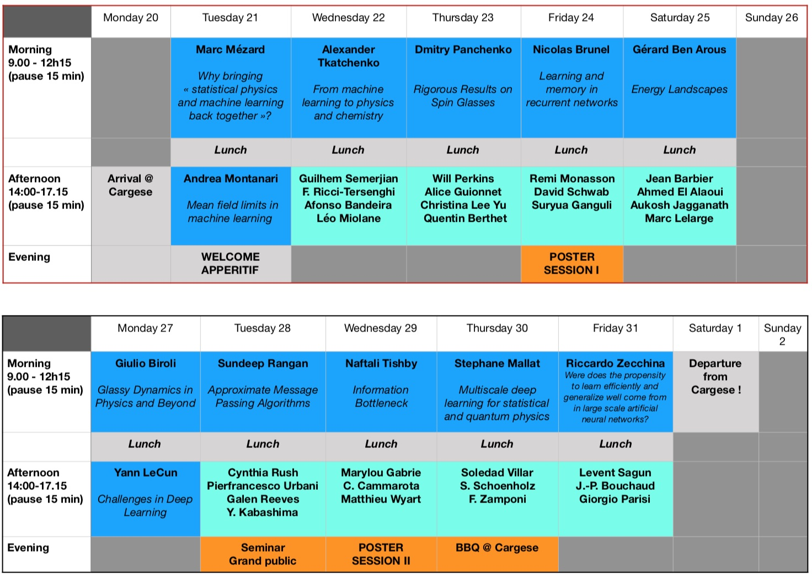

The past decade brought a revolution to machine learning: algorithms are now able to deal with tasks and amounts of data that seemed to be science fiction only a decade ago. The statistical physics community and the machine learning ones were connected and indeed many concepts and algorithms of machine learning have roots in physics. It is time to revive and strenghten this connection. After [a wonderful event in 2018](https://krzakala.github.io/cargese.io/), we gather once again in Cargese in 2023, and bring together researchers from machine learning & statistical physics to take full advantage of the strong link between the two fields to make further scientific progress.  The prorgam will cover both theoretical aspect of machine learning and statistics, and their deep link with physics, as well as the direct application of machine learning technics in physics, an activity that is currently whiteness a burst of activity. The format will be several (~10) 3h introductory lectures, and about twice as many contributed invited talks.

# Eminent scientists in the field will animate the event:
Marc Mézard (Ecole Normale, Paris), Gerard Ben Arous (Courant Institute), Giulio Biroli (CEA Saclay, France), Nicolas Brunel (Duke University), Yann LeCun (Courant Institute and Facebook), Stephane Mallat (ENS & College de France), Andrea Montanari (Stanford), Dmitry Panchenko (University of Toronto, Canada), Sundeep Rangan (New York University), Riccardo Zecchina (Politecnico Turin, Italy), Alexander Tkatchenko (Université du Luxembourg)
 
# Organization Committee:
Florent Krzakala (ENS Paris FR), Lenka Zdeborova (IPhT Saclay FR)

# Program at a glance: [Click here for detailed program](program.md)

#  Announcement: 
You enjoy the school ? We organizers (Florent Krzakala and Lenka Zdeborova) are looking for postdocs to work on on these topics in EPFL in Lausanne. Come talk to us during the conference!

# Twitter feed:
<a class="twitter-timeline"  href="https://twitter.com/hashtag/cargese2018" data-widget-id="942507543137521664">Tweets sur #cargese2018</a>            
          
          
<a href="https://twitter.com/intent/tweet?button_hashtag=cargese2018&ref_src=twsrc%5Etfw" class="twitter-hashtag-button" data-show-count="false">Tweet #cargese2018</a>

More information on [the institute webpage](http://www.iesc.univ-corse.fr/index.php?id=1&L=1)

